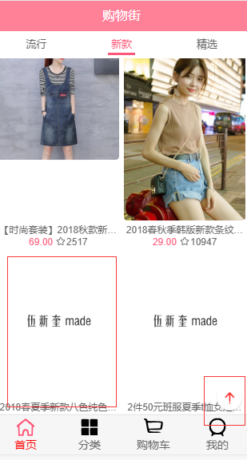
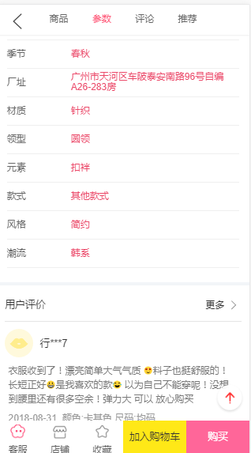
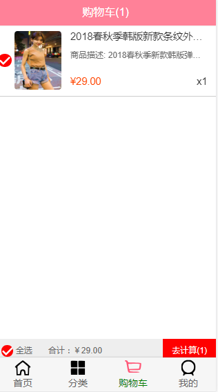
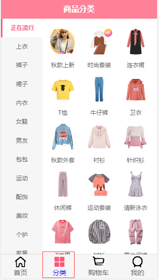
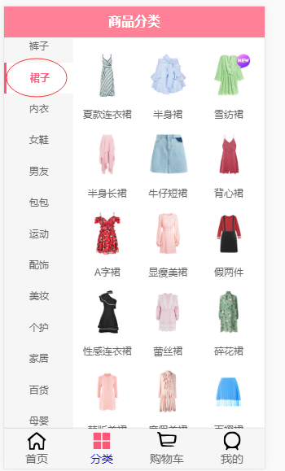
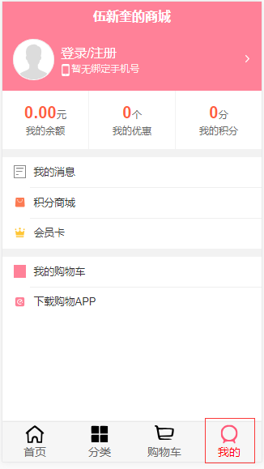

# supermall--一个基于Vue技术栈的购物商城的单页面应用

注：本项目是根据codewhy的vue项目，一步步自己手码出来的项目，并修改了一些bug，欢迎相互交流~

## Project prepare

```
git clone https://github.com/xinkuiwu/supermall.git
```

先把项目clone在本地

## Project setup

```
npm install
```

根据package.json的包依赖关系，使用npm安装各种依赖包 

### Compiles and hot-reloads for development

```
npm run serve
```

开发测试使用，可以直接使用该项目（点击local链接或者network链接），观看项目效果

### Compiles and minifies for production

```
npm run build
```

发布构建使用

## 项目说明

### 一、总览

	#### 1、项目功能

​	本项目基于vue技术栈，主要能实现购物商店的基本操作，如浏览商品种类及商品的详细信息，包括商品价格，参数，评论，相关推荐等；把商品添加在购物车并可自选或全选商品进行结账等功能。

​	此外还有一些优化功能，如返回页面顶部功能、滑动优化、上拉加载优化、懒加载等。

#### 2、该项目主要分为四大模块

​	本项目分为四个模块：首页，分类页，购物车页，个人页。其中，首页、分类页和购物车页的设计与实现是该项目的难点与重点。而个人页主要是一些CSS样式的布局而已。	

（首页，顶部是一个四个对象的轮播图）

（具体的商品展示，导航栏中的选项：流行、新款、精选，对应着不同商品的展示）

（例如，此时我们点了“新款”，展示的是新款的东西）

（当我们拖动应用的比较底部的位置时（上拉操作），会使用懒加载的方法加载我们新的商品数据；并且此时右下角有一个回到顶部的按钮）

(点进去某个商品，会跳转到详情页，当我们点击加入购物车，就会加入到购物车页中，并且页面浮动显示“添加了新的商品”的消息)

（详情页中，除了商品本身图片，还可以点击参数，评论，推荐等导航，跳转到对应部分，展示信息）

（购物车显示了刚刚我们添加的商品并且计算好对应价格；此外，还可以添加多个商品并且可以手动选择自己想要的那几个或者点击全选，全部都选）

（分类功能主要是展示一些商品的分类，并且可以根据不同类别，展示不同的商品）

（例如我们点击“裙子”，则显示裙子的相关商品）

（个人是一些CSS样式的布局和一些图标引用，后续我们可以扩展相关功能，如用户信息管理系统等等）

### 二、涉及的知识点

​	本项目是基于vue技术栈的单页面应用，涉及的知识点除了基本的JS编程、CSS3布局、HTML5，还有vue脚手架搭建，目录管理，封装思想，路由切换，父子组件通信，状态管理，网络数据请求，一些功能优化等等。

​	码完这个vue项目，基本对vue技术栈可以有个深刻的理解，后面的还是得继续边学边做。

### 三、后续可以做的工作（扩展）

分类页中的商品应该类似于首页一样，应该有对应类别的具体的商品展示，并且能够添加商品到购物车中。

个人页应该可以写一个用户管理系统，管理用户账号、密码信息，及其财产信息和其他购物信息等。

